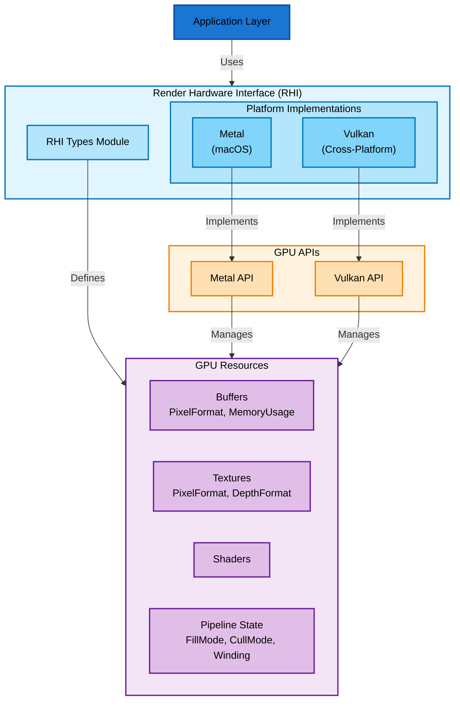

# Lys Engine

## Architecture

### Render Hardware Interface

The following diagram shows the implementation of the Render Hardware Interface (RHI).
The RHI declares generic types with behavior that is implemented by each platform implementation.
Each platform implementation implements the logic described by the RHI and manages GPU resources.

Any platform-specific features shall be exposed in only its low-level GPU interface.

